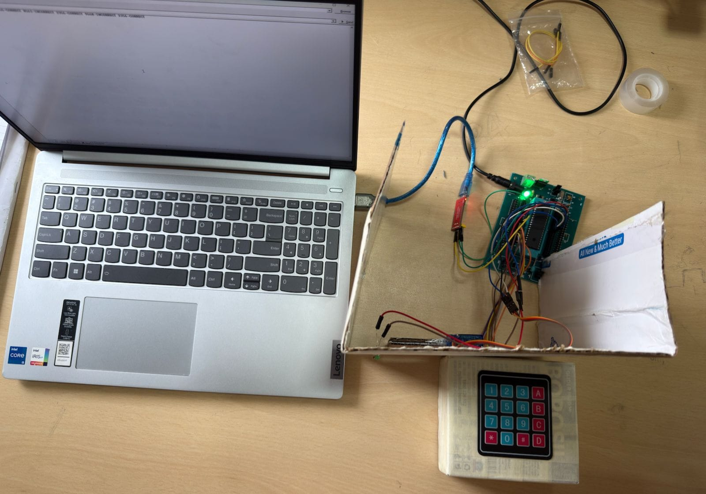

# Password-Based Door Lock System using PIC16F877A

An embedded systems project that implements a **password-protected door locking mechanism** using the **PIC16F877A microcontroller**, a **matrix keypad** for password authentication, a **servo motor** for door actuation, an **LED indicator** for status feedback, and **UART communication** for real-time monitoring through a laptop. The system was designed, implemented, and tested on a **physical hardware prototype** to demonstrate secure access control using microcontroller-based authentication.

---

## Overview

The objective of this project is to provide a simple and effective access control solution by allowing only authorized users to unlock the door through password verification.

The user enters a predefined password using a keypad connected to the PIC16F877A microcontroller. The entered password is transmitted to a laptop via UART for monitoring purposes. The microcontroller verifies the password and, if authentication is successful, actuates a servo motor to unlock the door while illuminating an indicator LED. The system also communicates door status information to the laptop through serial communication.

If an incorrect password is entered, the door remains locked and an access denial message is transmitted.

---

## Features

* Password-based access control
* Matrix keypad interfacing with PIC16F877A
* Servo motor-controlled door locking mechanism
* LED indication for successful authentication
* UART communication with a laptop
* Real-time transmission of entered passwords
* Door status monitoring through serial communication
* Embedded C implementation using MPLAB X IDE
* Physical prototype development and testing
* Automatic relocking after a predefined delay

---

## System Workflow

```text
User enters password
          ↓
PIC16F877A reads keypad input
          ↓
Entered password transmitted via UART
          ↓
Password verification
          ↓
Correct? ───── No ─────→ UART: "Access Denied"
    │                        ↓
   Yes                 Door remains locked
    ↓
UART: "Access Granted"
    ↓
Servo motor rotates
    ↓
Door unlocks
    ↓
LED turns ON
    ↓
UART: "Door Open"
    ↓
Predefined delay
    ↓
Servo returns to initial position
    ↓
LED turns OFF
    ↓
UART: "Door Closed"
    ↓
Door locks again
```

---

## Hardware Components Used

| Component                   | Purpose                              |
| --------------------------- | ------------------------------------ |
| PIC16F877A Microcontroller  | Main control unit                    |
| Matrix Keypad               | Password entry                       |
| Servo Motor                 | Door locking and unlocking mechanism |
| LED Indicator               | Visual status indication             |
| UART Interface              | Serial communication with laptop     |
| Breadboard and Jumper Wires | Circuit implementation               |
| External Power Supply       | Powers the system                    |

---

## Microcontroller Specifications

The project utilizes the **PIC16F877A**, an 8-bit RISC microcontroller featuring:

* 40-pin package
* 33 programmable I/O pins
* Operating voltage of 4V–5.5V
* Maximum clock frequency of 20 MHz
* Flash Program Memory: 8K words
* EEPROM Data Memory: 256 bytes
* Multiple timers for timing operations
* USART support for serial communication
* SPI and I²C communication capabilities

---

## Circuit Diagram



> The figure above illustrates the hardware connections used to implement the password-based door lock system.

---

## UART Communication

The system utilizes **UART (Universal Asynchronous Receiver/Transmitter)** communication to provide real-time feedback to a connected laptop.

Information transmitted includes:

* Entered password sequences
* Access granted notifications
* Access denied notifications
* Door open status
* Door closed status

This functionality improves system observability and demonstrates the integration of embedded systems with external monitoring interfaces.

---

## Software Tools Used

* MPLAB X IDE
* Embedded C
* XC8 Compiler (or the compiler used during development)
* Serial Terminal Software for UART monitoring

---

## Project Structure

```text
Password-Based-Door-Lock-using-PIC16F877A/
│
├── README.md
│
├── firmware/
│   └── PasswordDoorLock.X/
│       ├── main.c
│       ├── Makefile
│       └── nbproject/
│
├── images/
│   └── circuit_diagram.jpg
│
└── videos/
    └── demo_video_link.txt
```

---

## How the System Works

1. The user enters a password using the matrix keypad.
2. The PIC16F877A reads and stores the entered characters.
3. The entered password is transmitted to the connected laptop via UART.
4. The microcontroller compares the entered password with the predefined password stored in the firmware.
5. If the password is correct:

   * An "Access Granted" message is transmitted via UART.
   * The servo motor rotates to unlock the door.
   * The indicator LED turns ON.
   * The door remains unlocked for a short duration.
   * The servo returns to its initial position to lock the door.
   * The LED turns OFF.
   * A "Door Closed" message is transmitted.
6. If the password is incorrect:

   * An "Access Denied" message is transmitted.
   * The door remains locked.

---

## Demonstration Video

Watch the project in action:

[▶️ Watch the project demonstration](videos/demo.mp4)

---

## Applications

* Residential security systems
* Office access control systems
* Locker security mechanisms
* Restricted laboratory access
* Educational demonstrations of embedded authentication systems
* Low-cost access control solutions

---

## Advantages

* Improved security through password authentication
* Low-cost implementation using readily available components
* Real-time system monitoring using UART communication
* User-friendly operation
* Compact and scalable design
* Demonstrates practical embedded systems concepts
* Easy to expand with additional security features

---

## Future Improvements

Potential enhancements include:

* LCD display for user feedback
* RFID-based authentication
* Fingerprint sensor integration
* Alarm activation after multiple incorrect attempts
* IoT-enabled remote access monitoring
* Support for multiple user passwords
* Mobile application integration

---

## Educational Outcomes

This project provided practical experience in:

* Embedded C programming
* PIC microcontroller interfacing
* Matrix keypad scanning techniques
* Servo motor control
* LED interfacing
* UART serial communication
* Authentication logic implementation
* Hardware prototyping and testing
* Embedded system debugging techniques
* Access control system design

---

## Conclusion

The Password-Based Door Lock System successfully demonstrates the implementation of a secure embedded access control mechanism using the PIC16F877A microcontroller. By integrating keypad authentication, servo motor actuation, LED status indication, and UART-based monitoring, the project showcases the practical application of embedded systems in real-world security solutions while highlighting the importance of reliable communication and system integration.
